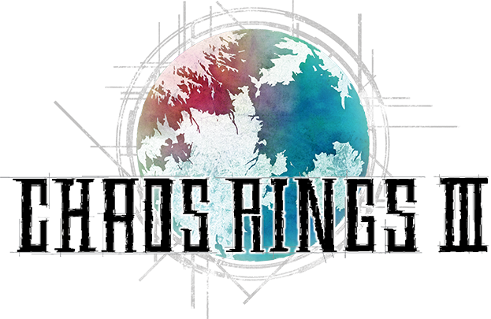

<h1 align=center>Chaos Rings III — Nintendo Switch port</h1>

This is a wrapper/port of the Android version of *Chaos Rings III*
(`com.square_enix.chaosrings3gp`, v1.1.4). It loads the original game engine,
patches it and runs it: the original Android `.so` runs natively inside a
minimal emulated Android environment, the same technique the FF4 3D port uses.

### How to install

You're going to need the **`.apk`** (and its install-time asset packs) for
version 1.1.4. The pieces you need are:

* `lib/arm64-v8a/libcrx.so` — the game engine
* `lib/arm64-v8a/libc++_shared.so` — its C++ runtime
* `assets/main.10007.android.mvgl` — the main game archive
* `assets/F0001.bin`, `assets/F0002.bin` — bundled fonts
* the Play Asset Delivery packs, which live inside `assets/data` (a ZIP).
  Extract these `*.android.mvgl` files out of it:
  * `CRDBmov.android.mvgl` (movies)
  * `CRDBse.android.mvgl` (sound effects)
  * `CRDBvoice.android.mvgl` (voices)
  * `CRDBbgm.android.mvgl` (music)

To install:
1. Create a folder called `chaosring3` in the `switch` folder on your SD card.
2. Copy the files above into `/switch/chaosring3/` (everything flat, no
   subfolders).
3. Copy **`chaosring3_nx.nro`** into `/switch/chaosring3/`.

So `/switch/chaosring3/` should contain at least: `chaosring3_nx.nro`,
`libcrx.so`, `libc++_shared.so`, `main.10007.android.mvgl`, `F0001.bin`,
`F0002.bin`, `CRDBmov.android.mvgl`, `CRDBse.android.mvgl`,
`CRDBvoice.android.mvgl`, `CRDBbgm.android.mvgl`.

### Notes

This will not work in applet/album mode. Use a game override (hold R on a
title) or a forwarder.

Save data and the port's `config.txt` are stored in `/switch/chaosring3/`.

### Controls

Chaos Rings III is a touch game. In **handheld** mode the touchscreen is passed
straight through. In **docked** mode (no touchscreen) the left stick drives a
virtual cursor and **A** taps. **B** / **+** map to the Android *Back* key
(cancel / menu-back).

### Configuration

`config.txt` is created on first run:
* `screen_width` / `screen_height` — render resolution; `-1` picks 1280×720
  handheld and 1920×1080 docked.
* `language` — `0` follows the Switch system language; otherwise
  `1` ja, `2` en.

### How to build

You're going to need devkitA64 and the following devkitPro packages:
* `switch-mesa`
* `switch-libdrm_nouveau`
* `switch-sdl2`
* `switch-freetype`
* `switch-libpng`
* `switch-harfbuzz`

### Credits

* fgsfds for [max_nx](https://github.com/fgsfdsfgs/max_nx), which this loader is
  based on
* TheOfficialFloW for the original Vita ports that pioneered this technique

### Support

If you enjoy my work and want to support me :

### Legal

This project has no direct affiliation with Square Enix. "Chaos Rings" is a
trademark of its respective owners. All Rights Reserved.

No assets or program code from the original game or its Android port are
included in this project. We do not condone piracy in any way, shape or form and
encourage users to legally own the original game.

Unless specified otherwise, the source code provided in this repository is
licensed under the MIT License. Please see the accompanying LICENSE file.
